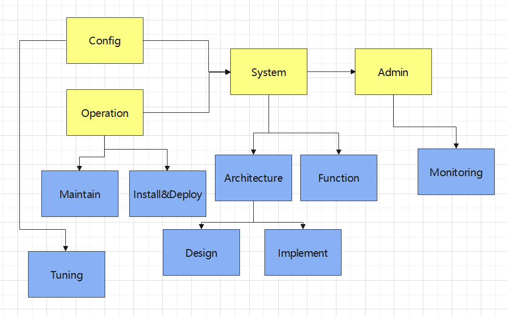
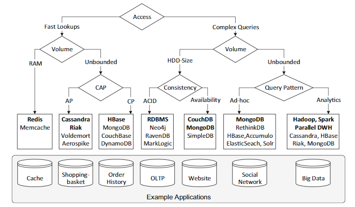
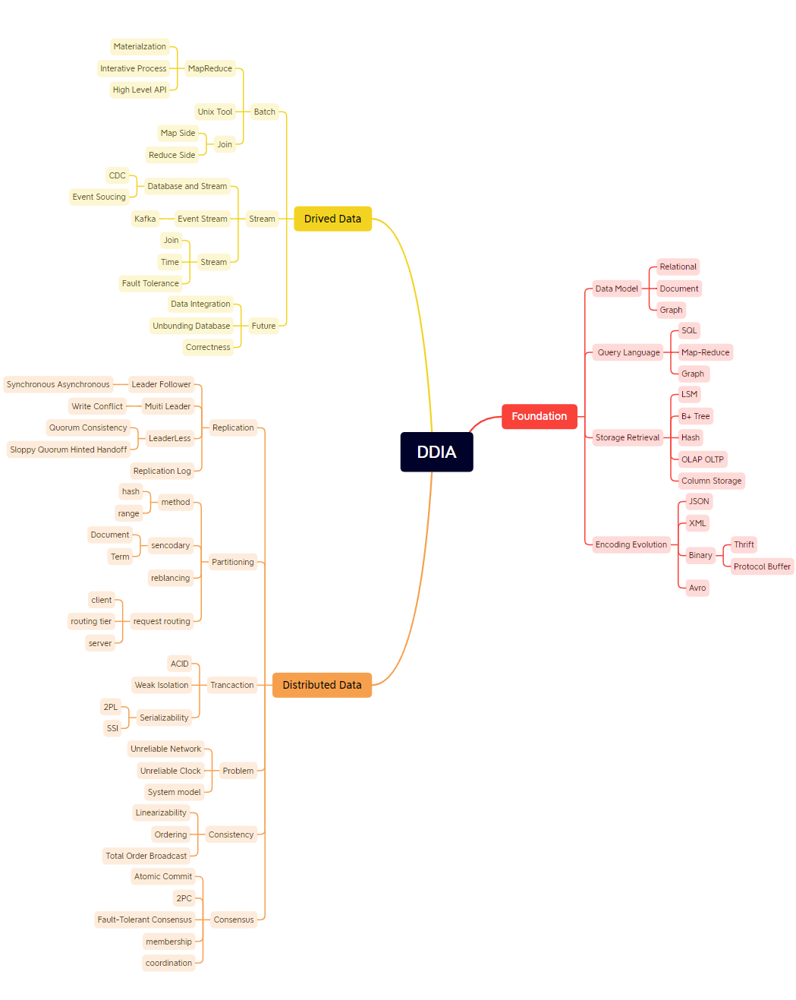
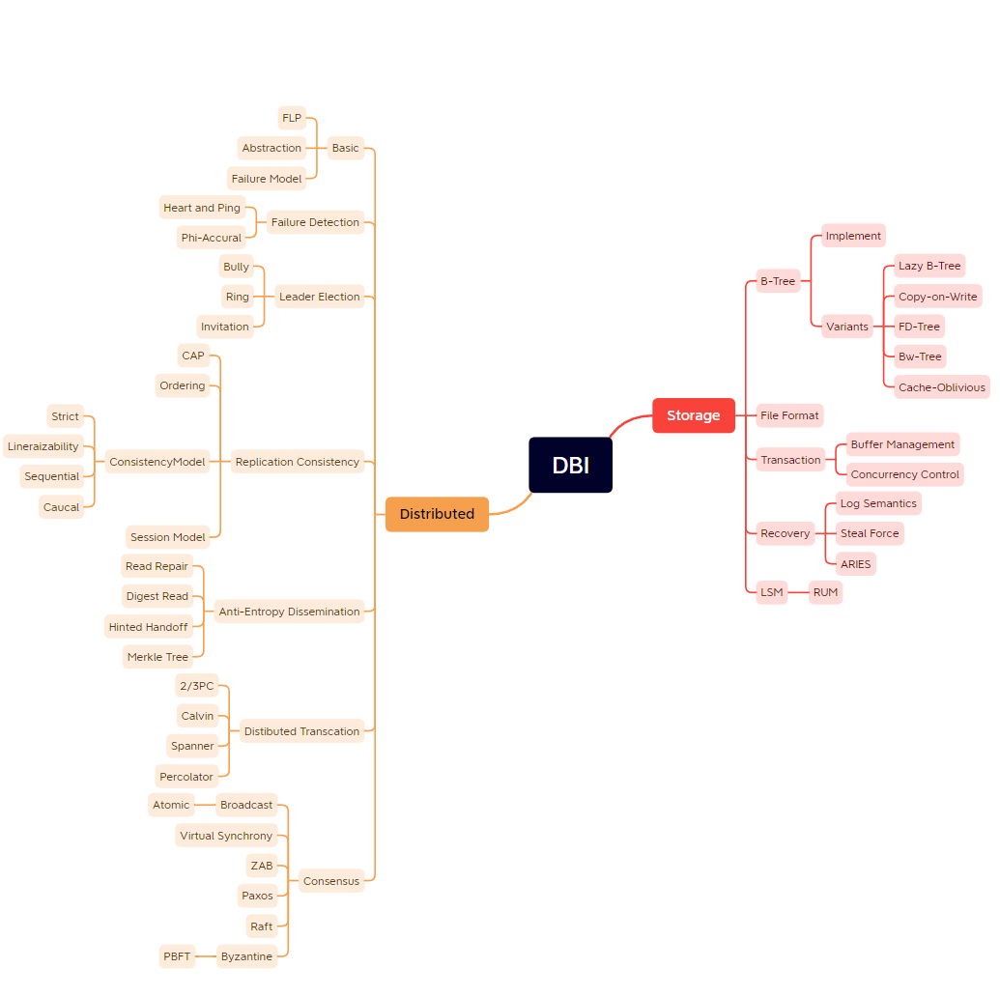

# 第八章

* 800 JDK源码必须作为个人学习Java技术的最重要基础，就像JDK是你的作品一样热爱。

---

* 801 面试候选人，同等水平下，会算法的优先考虑。

---

* 802 Effevtive Java：JDK源码指南。

---

* 803 Spring核心：给POJO提供声明式服务。

---

* 804 Java最值得投资学习的是集合和并发包。

------

* 805 Google，Amazon等论文更像是工程经验，并不学术论文。Google如何做系统？真正的系统设计是什么样的？为什么构建一个分布式系统会这么复杂？

---

* 806 技术学习：首先技术本身，其次技术生态（公司其他产品，关联上下游，定位等），最后技术商业。

---

* 807 算法，论文是科学主义，算法要证明正确，而不是跑通就行。论文要严谨，有数据有结论。工程是经验主义和实用主义，每个知识点很多，但是每一个都不复杂。也不会全部用到，能跑就行。

---

* 808 思维密度排行：数学>算法>工程，算法是对一个人思维活跃度，以及严谨程序，代码速度的考察。学好数学不应该局限于学好知识点，而是数学思维。

------

* 809 一个知识背后代表了一种思维模型。分布式系统思维模型，经常和一致性，共识性，复制。而数据系统，经常和事务，数据模型，存储模型，读写模型有关系。一个事物，有多种角度(模型)去理解。
  模型可以用来：推理，解释，设计，沟通，行动，预测，探索。

---

* 810 工程技术要学全面，但是不一定很深入。全：某个技术的知识体系。

---

* 811 技术深度因人而异，因事而异。深度应该关于思考，而不是知识本身。

---

* 812 技术考察维度：深度，广度，全面，质量，通达。

---

* 813 分布式系统的问题会在协议层，中间件(存储)层，应用框架层出现。越往上越对开发不透明。虽然都会在某种程度减少复杂度，但是最上层需要。

---

* 814 分布式系统关键一问：节点变化(新加，删除，宕机，超时，网络延迟)时，系统会发生了(一致性，可用性，正确性，复制)什么？

---

* 815 思维的强度以及复杂度：CS教材和算法。体系化培养的是思考问题能力和深度。

---

* 816 我们有时候过早陷入细节，而对设计问题闭口不谈。

---

* 817 AQS是基于状态的同步框架。实现类需要思考，状态是什么？

---

* 818 同步可以通过阻塞和非阻塞实现。

* | 类                         | 阻塞同步 | 非阻塞同步 |
            | -------------------------- | -------- | ---------- |
  | 原子变量                   |          | √          |
  | synchronize                | √        |            |
  | AbstractQueuedSynchronizer | √        |            |
  | LockSupport                | √        |            |
  | ReentrantLock              | √        |            |
  | ReentrantReadWriteLock     | √        |            |
  | StampedLock                | √        |            |
  | ArrayBlockingQueue         | √        |            |
  | ConcurrentHashMap          |          |            |
  | ConcurrentLinkedQueue      |          | √          |
  | ConcurrentSkipListMap      |          | √          |

---

* 819 多进程：多个进(线)程为你干活。分布式：多个机器为你干活。

---

* 820 一些系统的模板：
    * **AVO**(Atomic, Visible, Ordering)。
    * **ACID**(atomicity, consistency, isolation, durability)。
    * **C-LSP**(Correctness：Liveness, Safety, Performance)。
    * **APCNSCRFS**(Architectures, Process, Communication, Naming, Synchronization, Consistency and Replication,
      Faluttolerance, Security)。
    * **DDIA:RCM**(Reliablity，Scalablity，Maintainable)。
    * **CAP**(Consistency, Availability, Partition tolerance)。
    * **RUM**(Read Update Memory)。
    * **DDIA:MSERPTCC**(Model, Storage, Encoding, Replication, Partitioning, Transaction, Consistency and Consensus)。
    * **PACELC**（Partition tolerance，Availability，Consistency， Else， Latency， Consistency）。

---

* 821 分布式系统先研究功能，后研究分布式特性(如泛型和MSERPTCC)。从分布式特性看功能特性，如同提供kv服务的redis，consul，etcd功能类似，但是分布式特性截然不同。对于工程技术选型来说，最重要的是复制和一致性特性。

---

* 822 技术选型： 同样的功能**不同类型**，**同类型**的系统或中间件实现，最本质的区别是：系统设计以及架构权衡。

---

* 823 数据存储选型指南：1. 看得见的：从功能角度，从数据模型角度，从OLTP，OLAP，HTAP，非关系角度，从查询/写入角度。 2. 看不见的：从数据量角度，从复制角度，从CAP/PACELC/HAT角度，从分布式特性角度

---

* 824 JCF：接口定义类型，抽象实现骨架，实现千变万化。

---

* 825 存储系统核心拆分：内部实现，外部交互，架构属性。具体分为：

  - 单机特性
    - 数据模型
    - 存储模型
    - 读写性能

  - 分布式特性

    - 用户视角：读/写(增删改查)路径，启动/关闭过程。

    - 系统视角：一致性模型，复制，分区，共识，容错)。复制，共识，分区等等细节都会在用户读写路径视角展现。

---

* 826 NoSQL分类：数据模型，存储模型，一致性模型，物理模型，读写性能，辅助索引，故障处理，压缩，负载均衡，原子读-改-写，加锁等待死锁。

---

* 827 知识是一座摩天大楼，你可以在记忆的脆弱基础上走捷径，也可以在理解的钢架上慢慢建立。（知识取决于记忆和理解两个维度）

---

* 828 为了增加对事物（技术）的理解：读源码不是必须的，也是最慢速的方式。还可以通过书籍，论文，动手实践，他人经验。

---

* 829 读源码百分比：结构和设计优先，其次API，实现最后。HashMap 2000多行，结构占据了一半之多。

---

* 830 分布式锁本质是共识问题，需要多个节点共同认可某个节点是锁的占有者，否则就会认为自己也可以占有锁，redis做分布式锁并不是一个好的idea，因为本身并不提
  供共识功能，而是一个存储KV库。虽然选举算法可以选出来一个leader获取某个锁，但是并不是强一致性的，也不能满足安全性，活性，基于共识的分布式锁，
  如基于paxos的chubby（暴露文件系统API和分布式锁服务），或者zab的zk，raft的etcd是更好的选择。
  
---

* 831 保证多个系统的数据一致性，抽象比如内存和磁盘，磁盘和磁盘，内存和内存。（内存脏页和磁盘，数据写入和磁盘，内存和redis(磁盘+网络)），需要的机制是**事务**。事务提供了并发和恢复机制。单机
  数据库事务是处理这类问题最复杂机制。而内存和redis因为多了网络，会导致不确定性增加，解决这个问题方法终极方案依旧是事务（分布式事务），由于内存和redis之间并不存在分布式事务，所以双写方案从本质解决不了一致性问题。如果解决不了，那么异步方案会更好。此时就不是强一致性了。
  

注：事务提供了一种非常强大的抽象机制，保证了ACID特性。

---

* 832 存储系统：单机模型参考数据库系统，分布式模型参考分布式系统。

---

* 833 多个节点组成的计算机是分布式系统。会面临分布式系统的设计问题。不同系统面临分布式问题一样，区别在于单机所提供的功能。如业务系统中，弹性设计，缓存一致性，通信（同步或异步），数据复制（多系统），命名服务等等均是分布式系统问题。

---

* 834 分布式系统的技术大部分是之前提出的，只不过某个成功系统进行了很多集成，从而产生创新。（如GFS，BigTable，Dynamo）

---

* 835 业务层多系统数据一致性：复制。复制的具体技术有：双写（主动复制），一写一拉取（被动复制）

|          | 主动 | 被动                                                |
| -------- | ---- | --------------------------------------------------- |
| **同步** | 双写 | 暂无                                                |
| **异步** | 通知 | 定时任务拉取，异步写。（如MySQL，把系统想象从节点） |

---

* 836 SQL优化核心是：少进行磁盘操作（读写数据）。（数据建模合理，索引，关联查询 ->  查询优化器 -> 执行计划 -> BufferPool+磁盘），数据库都在努力做这件事，SQL只是这件事的外部视角。

---

* 837 系统设计：数据量是最重要的考虑点。

------

- 838 横纵技术论。
  缓存横向：操作系统缓存，数据库缓存，应用缓存。缓存纵向：缓存淘汰策略，缓存算法
  内存管理横向：操作系统内存管理，数据库内存管理，JVM内存管理，应用程序内存管理。 内存管理纵向：分页，分段，Buffer Pool
  类似的还有磁盘等等。

------

- 839 知识增长非累积，思维增长累积但非线性。知识积累会忘记，等于没有积累。思维复杂度上去了，就很难下来。学而不思则罔。思而不学则殆。

------

- 840 为什么用MQ（Bounded Buffer）？1 系统通信方式，其他方式不能这么通信。 2 系统处理速度不一致。3 数据从静止变成流动的。data at rest到data in motion（table and stream）。如异步，解耦，削峰，扩展性只是1,2带来的效果。也是传统MQ功能，但是新的MQ是实时处理平台。

为什么用Kafka？1 ksqldb，stream，table 2 data integration 3 real stream process（生态是什么？）

个人选择偏好:Kakfa > RocketMQ > RabbitMQ 

---

- 841 消息中间件选型是非功能性优于功能性的原则。优先性能，其次功能。性能上不去，很难优化。功能没有，可以添加。不同存储选型是功能性优于非功能性（如性能）。因为数据模型重要性高于性能，且数据模型本身影响性能。但是同类型存储选型依旧非功能性优于功能性。
  非功能性包括：数据量，性能，可用性，高可用，社区生态，个人/团队熟悉。
  功能性包括：能不能满足需求？

---

- 842 三大系统软件：操作系统，数据库，编译器。操作系统和数据库可以对比。

---

- 843 文本编辑器的恢复机制 
  - UNDO：撤销，reverse your last action， CTRL+Z   
  - REDO：重做，reverse your last Undo， CTRL+Y

---

- 844 数据库的恢复机制

  - UNDO：Reverse the actions of txns that did not commit before  the crash。

  - REDO：Repeat all actions starting from an appropriate point in  the log。
  
---

- 845 存储系统单机视角：内存，磁盘。MySQL,ES,HBase,Cassandra,Redis,MongoDB

---

- 846 技术选型本质是从N个因素中选出你真正认为重要的因素，这些因素可能需要互相权衡，可以是长期，短期。从而服务于你的目的.

---

- 847 Buffer:速度不一致. Cache:提高速度.

---

- 848 mq and db:一个数据一直在流动，一个数据一直在静止。

---

- 849 关注思维，认知与方法。比如如何学习，如费曼学习法，如何阅读，系统学习，模型思维，体系化，结构化，整体化思维，认知，复杂思维，系统化思维，分形结构，批判性思维，数学思维，算法思维，科学方法等等。
---

- 850 JVM的AVO可以对标DB的ACID。而原子性概念非常强大和通用。CAS，物理的原子，

---

- 851 锁是一种逻辑概念，依赖于算法，而cas只是实现的算法的一个指令。

---

- 852 Jepsen一致性模型：1.CAP中将A也分级了，2.结合了DB和分布式一致性。

---

- 853 系统研究点：

黄色上层：系统基本结构。

蓝色下层：系统基本结构分解和扩展。

---

- 854 技术选型模型：
  - 定性：静态的因素占比法（f(x)=a+b+c+d），动态的决策树模型，案例分析法，成本收益分析法 。
  - 定量：数据对比。因素占比法最关键的是你认为最重要的因素是什么。决策树模型分支上面是因素。

---

- 855 NoSQL Toolbox:

---

- 856 NoSQL Decision Tree:

---

- 857 分布式系统问题模型：

---

- 858 分布式系统知识体系：

---

- 859 DDIA思维导图：

---

- 860 数据库系统内幕思维导图：

